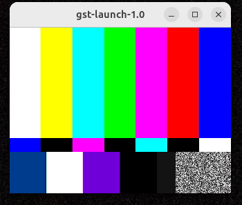

# l4t-jetpack — JetPack 7.2.1 image (L4T r39.2.1, Ubuntu 24.04, Thor / Orin)

A working, corrected build of the NVIDIA L4T JetPack developer image for
**JetPack 7.2.1 (L4T r39.2.1)** on Jetson AGX Thor and Orin devkits.
Ubuntu 24.04 Noble, aarch64. Based on `nvcr.io/nvidia/base/ubuntu:24.04`
plus the `repo.download.nvidia.com/jetson/{common,som,ffmpeg} r39.2` apt repos.

Published image: [`whitesscott/l4t-jetpack`](https://hub.docker.com/r/whitesscott/l4t-jetpack) on Docker Hub.

## Build

```bash
make image_jp72

# On a host where render GID differs from Thor default (993):
make image_jp72 RENDER_GID=$(getent group render | cut -d: -f3)
```

## Sanity check

```bash
make smoke_jp72
```

## Run

```bash
docker run -it --rm --name jetpack --network host \
  --runtime=nvidia --gpus=all \
  -e DISPLAY=$DISPLAY -v /tmp/.X11-unix/:/tmp/.X11-unix \
  --privileged --ipc=host \
  --ulimit memlock=-1 --ulimit stack=67108864 \
  --shm-size=16g \
  -e NVIDIA_VISIBLE_DEVICES=all \
  -e NVIDIA_DRIVER_CAPABILITIES=all \
   whitesscott/l4t-jetpack:r39.2.1
```

### With secure X11 auth (recommended for X11 forwarding)

The block above works if you run `xhost +local:root` on the host first (see the "Test X11 forwarding" section). If you'd rather not open the X server to any local root process, mount your MIT-MAGIC-COOKIE-1 auth file into the container instead:

```bash
docker run -it --rm --name jetpack --network host \
  --runtime=nvidia --gpus=all \
  -e DISPLAY=$DISPLAY -v /tmp/.X11-unix/:/tmp/.X11-unix \
  -e XAUTHORITY=/tmp/.Xauthority \
  -v $XAUTHORITY:/tmp/.Xauthority:ro \
  --privileged --ipc=host \
  --ulimit memlock=-1 --ulimit stack=67108864 \
  --shm-size=16g \
  -e NVIDIA_VISIBLE_DEVICES=all \
  -e NVIDIA_DRIVER_CAPABILITIES=all \
  nvcr.io/nvidia/l4t-jetpack:r39.2.1
```

Requires `$XAUTHORITY` to be set on the host (it is by default under GDM/GNOME; check with `echo $XAUTHORITY`). No `xhost` command needed — the container authenticates as your user.

## Test X11 forwarding

The `-e DISPLAY` + `-v /tmp/.X11-unix` mount in the run command wires up X11 so containerized apps can open windows on the host desktop. Quick verification, inside the container:

```bash
xeyes                                # simplest: a pair of eyeballs on your Thor desktop
```

Full GStreamer video pipeline to the display (proves X + Xv + GStreamer plugin registry all work):
```bash
gst-launch-1.0 videotestsrc num-buffers=300 pattern=smpte ! videoconvert ! xvimagesink
```

An SMPTE color-bar test pattern window should appear on your Thor desktop for ~10 seconds:



If either fails with **"No protocol specified"**, the X server rejected the container's auth. Quick fix on the host (dev workstations only):
```bash
xhost +local:root   # reverse with: xhost -local:root
```

Note: `ximagesink` (without the `xv`) will fail with a `BadValue` / `XInputExtension` error on Thor — protocol version mismatch between the container's libX11 and the host's X server. Use `xvimagesink` instead; it produces a better image anyway.

## Push to Docker Hub

```bash
docker login
make push_jp72   # tags r39.2.1, jp7.2.1-thor, latest and pushes all three
```

Override the Hub namespace on the fly:
```bash
make push_jp72 HUB_REGISTRY=docker.io/your-org/l4t-jetpack
```

## Confirmed working on NVIDIA Thor (SM 11.0)

- **CUDA 13.2.2** — `nvcc` compiles + on-device kernel executes (`atomicAdd` returns expected 65536)
- **cuDNN 9.20.0.46** — `cudnnGetVersion()` returns 92000 via real link
- **TensorRT 10.16.2** — `getInferLibVersion()` returns 101602; builder resources present for sm_110, sm_100, sm_120, sm_75-89
- **cuDLA 13.2** — headers + libs installed (runtime not exercised)
- **VPI 4.1.4** — Python `import vpi` succeeds
- **OpenCV 4.8.0** — Python `import cv2` succeeds
- **PyTorch** — installable via `pip install --index-url https://pypi.jetson-ai-lab.io/sbsa/cu132 torch`; `torch.mm` on `device="cuda"` runs on Thor
- **Multimedia** — GStreamer 1.24.2 + NVIDIA plugins (`nvarguscamerasrc`, `nvv4l2camerasrc`, `nvv4l2decoder`, `nvv4l2h264enc`, `nvv4l2h265enc`, `nvvidconv`); H.264 hardware encode with NVMM zero-copy verified end-to-end
- **Auto-arch** — entrypoint sets `TORCH_CUDA_ARCH_LIST` from `__nvcc_device_query` (Thor → `11.0`, Orin → `8.7`)

Also included: `build-essential`, `git`, `rsync`, `openssh-client`, `xauth` + `x11-apps` (`xeyes`/`xclock`) + `gstreamer1.0-x` for X11 display forwarding, `python3` + `pip` + `numpy`, locale set to `en_US.UTF-8`, `render`/`video` groups pre-created at Thor default GIDs.

Not included (add downstream if needed): DeepStream, Triton, Isaac ROS, DALI, FFmpeg.

## Inspect the published image

The Docker Hub overview intentionally doesn't paste the full Dockerfile — it goes stale on every rebuild. Inspect the actual pushed image directly:

```bash
docker pull whitesscott/l4t-jetpack:latest
docker history whitesscott/l4t-jetpack:latest --no-trunc   # every RUN/COPY layer with its command
docker inspect whitesscott/l4t-jetpack:latest | jq '.[0].Config'   # ENV, ENTRYPOINT, CMD, exposed ports
```

These always reflect the manifest of the exact image you're about to run — no drift possible.

## Image size

- ~10 GB uncompressed (developer packages: CUDA toolkit + cuDNN + TRT + VPI + OpenCV all with headers).
- ~3-4 GB compressed on the wire when pulling from Docker Hub.

## Upstream

Original NVIDIA source: https://gitlab.com/nvidia/container-images/l4t-jetpack
NGC catalog: https://catalog.ngc.nvidia.com/orgs/nvidia/containers/l4t-jetpack

Pull upstream changes into this fork:
```bash
git fetch upstream
git log HEAD..upstream/master --oneline   # see what's new
git merge upstream/master                  # or rebase
```
